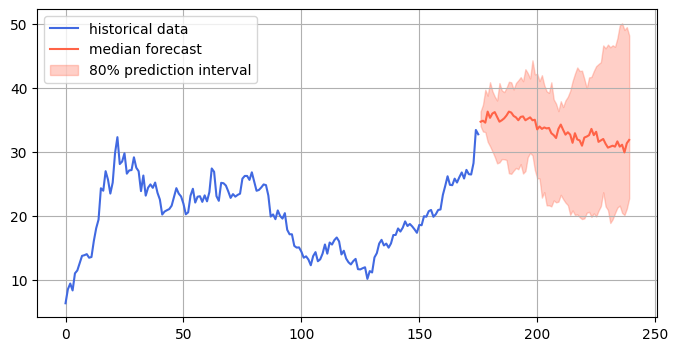
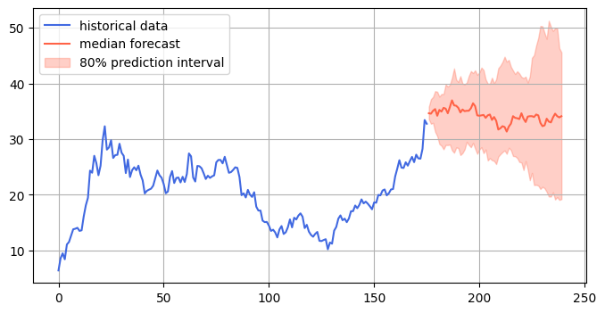
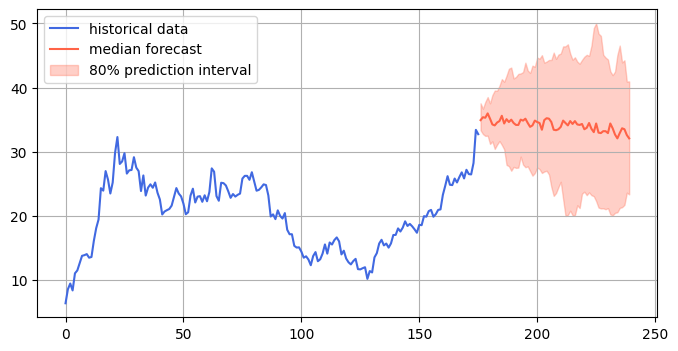

# Hyperliquid Forecasting analysis

## What is HYperliquid?
Hyperliquid is a decentralized exchange (DEX) built on its own high-performance Layer-1 blockchain, HyperEVM, designed specifically for derivatives trading, particularly perpetual futures contracts. It combines the speed and user experience of centralized exchanges (CEXs) with the transparency and security of decentralized finance (DeFi). 
Key features include:
- High-Speed Trading: Utilizes a custom consensus mechanism, HyperBFT, enabling up to 200,000 transactions per second with sub-second finality.
- On-Chain Order Book: Unlike many DEXs that use automated market makers (AMMs), Hyperliquid employs a fully on-chain order book for transparent, low-slippage trading.
- Low Fees: Offers competitive, flat fees for all traders and eliminates gas fees for transactions.
- Advanced Trading Tools: Supports up to 50x leverage, various order types (market, limit, stop-loss, TWAP), and features like copy-trading and vaults for liquidity provision.
- HYPE Token: The native token, launched via a major airdrop in November 2024, is used for governance, staking, and fee payments.
- No KYC: Allows trading without identity verification, emphasizing user privacy.
- HyperEVM: A smart contract environment compatible with Ethereum, enabling developers to build DeFi applications.

Founded by Harvard alumni Jeff Yan and Iliensinc, with a team from institutions like MIT and Citadel, Hyperliquid launched its mainnet in 2023. It has grown rapidly, achieving over $100 billion in all-time trading volume and a market cap of around $12.5 billion as of May 2025. However, its relatively centralized structure (16 validators compared to Ethereum’s 800,000) and untested blockchain have drawn criticism for potential risks like downtime or oracle manipulation.

## Basic Statistics of Hyperliquid:

- Price Range: The price ranged from a minimum of $6.42 to a maximum of $37.44 throughout the period.
- Volume: The data shows a wide variety of trading volumes, with the 75th percentile being about 255.23 million and the maximum volume in a period being 674.32 million.
- Missing Values: No missing values detected in any column.
- Market Capitalization: Market cap grew significantly from $0 to a maximum of $11.64 billion, with an average of $6.61 billion.
- Price Volatility: Standard deviation of approximately $5.56 indicates moderate price volatility, with consistent trading activity across 176 data points spanning from November 2024 to May 2025.

## Forecast using pretrained model from Amazon

### Picture A

### Picture B

### Picture C

