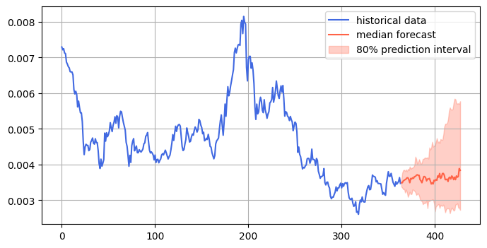
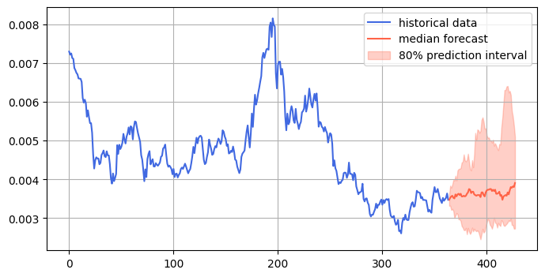
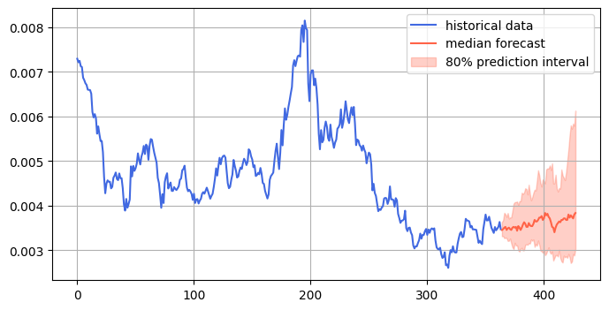

# Siacoin Forecasting Analysis

  

## What is Siacoin?

Siacoin (SC) is the native cryptocurrency of the Sia network, a decentralized cloud storage platform built on blockchain technology. Sia enables users to rent storage space from a global network of hosts, offering a secure, private, and cost-effective alternative to centralized cloud storage providers like Google Drive or Amazon S3. Here’s a concise overview:

- Purpose: Siacoin is used to pay for storage, bandwidth, and smart contracts on the Sia network. Users spend SC to rent storage, while hosts earn SC for providing it.
- Decentralized Storage: Files are encrypted, split into pieces, and distributed across multiple hosts worldwide, ensuring redundancy and privacy. No single entity controls the data.
- Consensus Mechanism: Sia uses Proof-of-Work (PoW) with the Blake2b algorithm, similar to Bitcoin, for securing the network and minting new Siacoin.
- Key Features:
  - Low costs: Storage is significantly cheaper than centralized providers (e.g., ~$2/TB/month vs. $20+/TB for AWS).
  - Privacy: Files are encrypted client-side, and hosts cannot access data.
  - Redundancy: Data is replicated across hosts to prevent loss.
- History: Launched in 2015 by David Vorick and Luke Champine under Nebulous (now Skynet Labs), Sia aims to disrupt centralized cloud storage.
- Market Data (as of May 2025): Based on recent web data, Siacoin’s price is around $0.0045–$0.005, with a market cap of approximately $260–$270 million, ranking it around #200 among cryptocurrencies.
- Challenges: Sia faces competition from projects like Filecoin and Arweave, and its user interface can be complex for non-technical users. Adoption is growing but remains niche.

Siacoin is integral to Sia’s vision of a decentralized internet, where users control their data without relying on centralized intermediaries. For more details, you can explore Sia’s official site or check recent posts on X for community sentiment.

## Forecast using pretrained model from Amazon

### Picture A

### Picture B

### Picture C

## Siacoin (SIA) Price Forecasting Analysis

### Chart Interpretation (Simple Breakdown)

What You're Looking At:
- Blue Line: SIA's actual price history - what already happened
- Red Line: Our AI model's prediction for future prices
- Red Shaded Area: The "uncertainty zone" - where price could realistically go

### The Story the Chart Tells:

- Past Performance: SIA started around $0.007 → dropped to $0.004 → had major spike to $0.008 → crashed back to $0.003
- Current Position: Price is at relatively low levels around $0.003-0.0035
- Future Prediction: Model expects gradual recovery to $0.0037-0.004 range

## Price Direction Prediction

### Short-term Outlook (Next 1-2 Months):

- Direction: SIDEWAYS TO SLIGHTLY UP 📈
- Target Range: $0.0037-0.004 (median prediction)
- Why: After major correction from $0.008 peak, model expects slow recovery from oversold levels

### Probability Scenarios:

- Most Likely (50%): Price recovers to $0.0037-0.004 range
- Bullish Case (25%): Could push to $0.005-0.006 if buying pressure increases
- Bearish Case (20%): Further decline to $0.0025-0.003 support
- Extreme Moves (5%): Back to $0.008 highs or below $0.002

### Key Insights & Recommendations

🔍 Key Insights:
- Strong Support at $0.0025-0.003: This level is holding after the major crash
- Recovery Pattern: Model shows gradual upward trend from current lows
- Lower Volatility: Prediction bands are tighter than HYPE, suggesting more stable movement
- Oversold Bounce: Current levels appear to be near bottom based on historical patterns

💡 Recommendations:
For Current SIA Holders:
- Hold positions - worst appears to be over based on model
- Average down if you believe in long-term potential
- Set targets around $0.004-0.005 for partial profit-taking

For Potential Buyers:

- Good entry opportunity at current $0.003 levels
- Dollar-cost average over next few weeks
- Consider accumulating - risk/reward favorable at these levels

Risk Management:

- Stop-loss below $0.0025 (historical support)
- Position sizing - SIA is higher risk/reward than major cryptos
- Patience required - recovery may be gradual, not explosive

Bottom Line:
Model suggests SIA has found a bottom around $0.003 and expects gradual recovery to $0.004 range. Current levels offer attractive risk/reward for patient investors, with limited downside and decent upside potential. Much more favorable setup than HYPE at current prices.

Risk Level: Medium - Lower than HYPE due to oversold conditions, but still volatile crypto asset.

